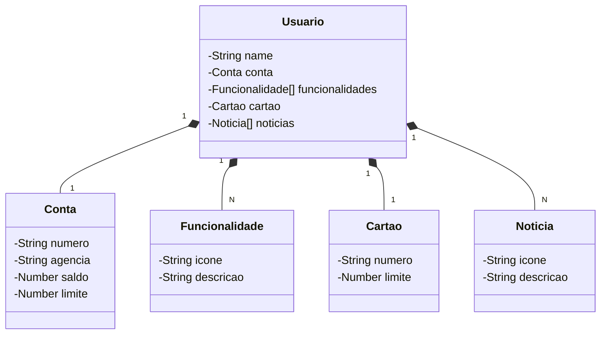

# Java AI Powered

# Projeto do Bootcamp DIO Java AI Powered

## Diagrama de classes

```mermaid
  classDiagram
    class Usuario{
      -String name
      -Conta conta
      -Funcionalidade[] funcionalidades
      -Cartao cartao
      -Noticia[] noticias
    }

    class Conta{
      -String numero
      -String agencia
      -Number saldo
      -Number limite
    }

    class Funcionalidade{
      -String icone
      -String descricao
    }

    class Noticia{
      -String icone
      -String descricao
    }

    class Cartao{
      -String numero
      -Number limite
    }

    Usuario "1" *-- "1" Conta
    Usuario "1" *-- "N" Funcionalidade
    Usuario "1" *-- "1" Cartao
    Usuario "1" *-- "N" Noticia
```
